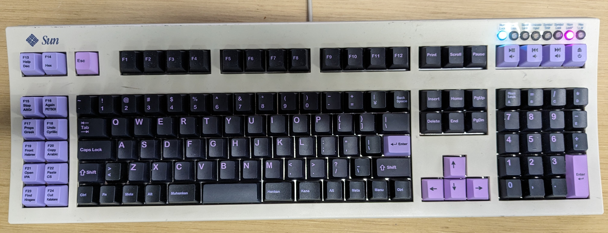

# K130
Battlestation keyboard with 130 keys! It's an ANSI keyboard! It's an ISO keyboard! It's a JIS keyboard! It's all of the above!

I have successfully built and used two of these keyboards, so the design and software is pretty much done, but the documentation is still a work in progress.

## Stuff to Get
* 130x Cherry MX compatible keyswitches
* 130x through-hole 1N4148 diodes
* 1x through-hole 1-pin male header
* 3x through-hole 4-pin 2.54mm-spacing male header
* 3x through-hole 5-pin 2.54mm-spacing male header
* 1x through-hole 11-pin 2.54mm-spacing male header
* 1x through-hole 12-pin 2.54mm-spacing male header
* 2x through-hole 14-pin 2.54mm-spacing male header
* 10x Mill-Max Manufacturing Corp 0906-8-15-20-76-14-11-0 POGO pins (FANCY!)
* 1x Teensy 4.0 microcontroller
* 1x through-hole 6-switch DIP switches
* 3x through-hole 150 ohm resistors
* 3x through-hole LEDs *or* 3x through-hole NeoPixel LEDs *or* 1x NeoPixel strip
* 1x USB-B connector *or* 1x microUSB-B connector
* 2x 2u stabilizers
* a standard set of keycaps
* a case specifically from a Sun Microsystems Type 5c keyboard (these are plentiful on eBay and you don't have to feel bad about gutting one since the membrane on these things is pure crap)

## Stuff to Make
* 1x keyboard matrix PCB, made from the Gerber files in the `K130-matrix-gerber` directory
* 1x keyboard encoder PCB, made from the Gerber files in the `K130-encoder-gerber` directory
* 1x aluminum mounting plate, made from the `K130-plate.svg` file
* a bunch of additional keycaps for the 30 or so other keys, made from the templates in the `keycaps` directory (more details needed)

## Stuff to Do
* Program the Teensy 4.0 microcontroller with the Arduino sketch in the `Arduino/K130` directory
* Solder in the diodes on the matrix PCB **first**
* Insert the stabilizers into the aluminum mounting plate
* Insert the keyswitches into the aluminum mounting plate and matrix PCB
* Double check with a multimeter that all the keyswitches work!
* Only **after** checking the keyswitches solder them to the matrix PCB!
* Assemble the encoder board
* Solder the matrix board to the encoder board **last**
* Install the keycaps
* Check that the keyboard works
* Assemble the keyboard case

## DIP Switches
* SW1 OFF, SW2 OFF - Universal mode. ANSI, ISO, and JIS layout simultaneously.
* SW1 ON, SW2 OFF - ANSI mode. Remaps JIS yen → backspace, ISO backslash → enter, ISO less/greater → left shift, JIS backslash → right shift, JIS muhenkan/henkan/kana → space.
* SW1 OFF, SW2 ON - ISO mode. Remaps JIS yen → backspace, ANSI backslash → enter, JIS backslash → right shift, JIS muhenkan/henkan/kana → space.
* SW1 ON, SW2 ON - JIS mode. Remaps ANSI backslash → enter, ISO less/greater → left shift.
* SW3 OFF - PC modifier layout. Ctrl, Meta, Alt on left side; Alt, Meta, Ctrl on right side.
* SW3 ON - Mac modifier layout. Ctrl, Alt, Meta on left side; Meta, Alt, Ctrl on right side.
* With SW6 OFF:
  * SW4 OFF - Left keypad is mapped to F13-F24.
  * SW4 ON - Left keypad is mapped to corresponding keys on a Sun keyboard (Help, Stop, Props, Front, Open, Find, Again, Undo, Copy, Paste, Cut).
  * SW5 OFF - Numeric keypad is mapped normally.
  * SW5 ON - Num lock, =, /, \*, -, + are mapped to letter keys A-F, giving you a hexadecimal pad.
* With SW6 ON:
  * **Super input mode!**
  * Press Dec for Unicode decimal input. Press Hex for Unicode hexadecimal input.
  * Press Dec twice to toggle **num lock lock**. The numeric keypad will always produce numbers regardless of num lock.
  * Press Hex twice to toggle **hex lock lock**. Like num lock lock, except with a hexadecimal pad.
  * Press other left keypad keys once to input a non-ASCII character.
  * Press twice to input multiple non-ASCII characters.
  * Press twice again to return to normal input.
  * SW4 OFF, SW5 OFF - Unix mode; non-ASCII characters are input using Ctrl+Shift+U + code point in hex.
  * SW4 ON, SW5 OFF - Windows decimal mode; non-ASCII characters are input using Alt + Numpad 0 + code point in decimal.
  * SW4 OFF, SW5 ON - Windows hexadecimal mode; non-ASCII characters are input using Alt + Numpad Plus + code point in hex.
  * SW4 ON, SW5 ON - Mac mode; non-ASCII characters are input using Option + UTF-16 code units in hex.

## Layouts

